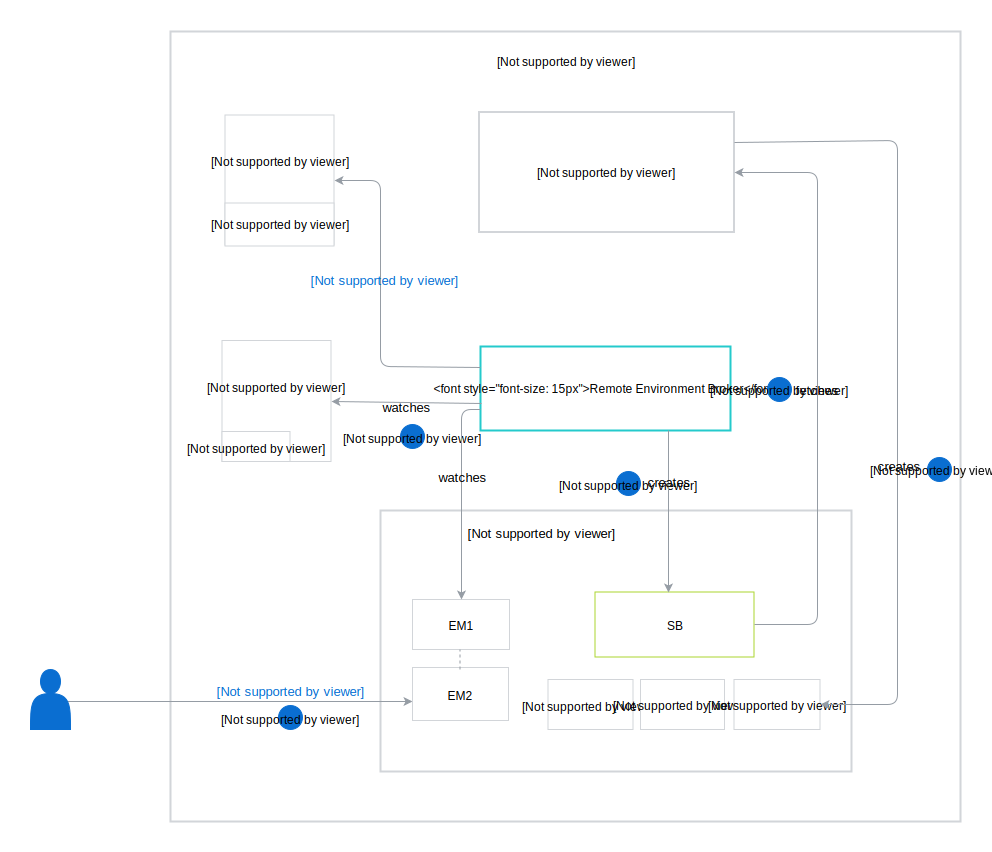

The Remote Environment Broker (REB) workflow consists of the following steps:

1. The Remote Environment Broker watches for RemoteEnvironment (RE) custom resources in the cluster and EnvironmentMappings (EM) in all Environments.
2. The user creates an EnvironmentMapping custom resource in a given Environment. Together with the EnvironmentMapping, a `remote-env-broker` Service Broker (SB) appears. one SB per namespace even if EM more
3. The `remote-env-broker` Service Broker (SB) exposes services provided by a given RemoteEnvironment.
3. The Service Catalog asks the `remote-env-broker` about the services provided by the given RemoteEnvironment and creates ServiceClasses inside a given Namespace.
4. The user can provision ServiceInstances from the ServiceClasses in a given Namespace.

When this process is complete, you can provision and bind your services.

### Provisioning and binding for an API ServiceClass

This ServiceClass has a **bindable** flag set to `true` which means that you have to provision a ServiceInstance and bind it to the service or lambda to connect to the given API. The provisioning and binding workflow for an API ServiceClass consists of the following steps:
1. Select a given API ServiceClass from the Service Catalog.
2. Provision this ServiceClass by creating its ServiceInstance in the given Environment.
3. Bind your ServiceInstance to the service or lambda. During the binding process, ServiceBinding and ServiceBindingUsage resources are created.
    * ServiceBinding contains a Secret with a GatewayURL needed to connect to the given API.
    * ServiceBindingUsage injects the Secret, together with the label given during the registration process, to the lambda or service.
4. The service or lambda calls the API through the Application Connector. The Application Connector verifies the label to check if you have the authorization to access this API.
5. After verifying the label, the Application Connector allows you to access the remote environment API.

### Provisioning and binding for an Event ServiceClass

This ServiceClass has a **bindable** flag set to `false` which means that after provisioning a ServiceClass in the Environment, given Events are ready to use for all services. The provisioning workflow for an Event ServiceClass consists of the following steps:
1. Select a given Event ServiceClass from the Service Catalog.
2. Provision this ServiceClass by creating a ServiceInstance in the given Environment.
3. During the provisioning process, the EventActivation resource is created together with the ServiceInstance. EventActivation allows you to create an Event Bus Subscription.
4. A Subscription is a custom resource by which an Event Bus triggers the lambda for a particular type of Event in this step.
5. The Remote Environment (RE2) sends an Event to the Application Connector.
6. The Application Connector sends an Event to the lambda through the Event Bus.

### Provisioning and binding for both the API and Event ServiceClass

This ServiceClass has a **bindable** flag set to `true`.
The provisioning and binding workflow for both the API and Event ServiceClass is a combination of steps described for an [API ServiceClass](#provisioning-and-binding-for-an-api-serviceclass) and an [Event ServiceClass](#provisioning-and-binding-for-an-event-serviceclass).
